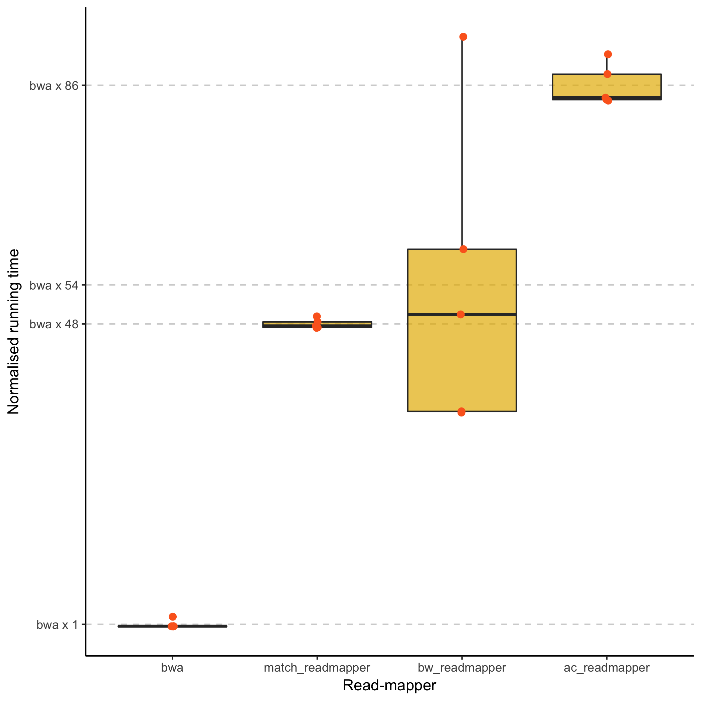

# Read-mapper project for Genome Scale Algorithms

## Downloading the testing and evaluation scripts

You can download the scripts as [a ZIP file](https://github.com/bioinfau/gsa-read-mapper/archive/master.zip), but if you are familiar with Git, then an easier solution is to clone this repository

```sh
git clone https://github.com/bioinfau/gsa-read-mapper.git
```

If you plan to use the clone as a shared repository to work with during the project, you might want to fork it before you clone your own copy.

## Using the scripts


## The data files

## Evaluation

The current status of the read-mappers are:



