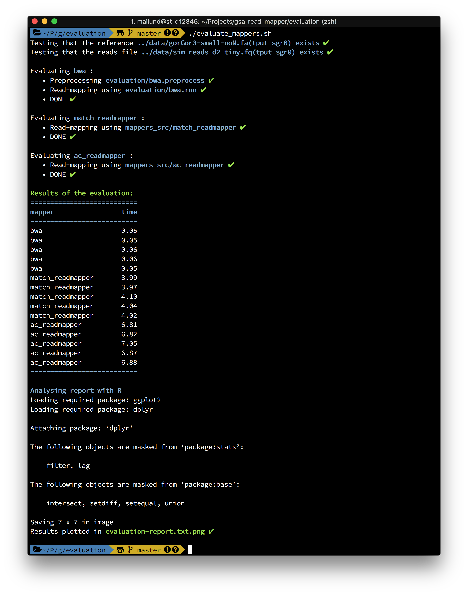

# Read-mapper project for Genome Scale Algorithms

## Downloading the testing and evaluation scripts

You can download the scripts as [a ZIP file](https://github.com/bioinfau/gsa-read-mapper/archive/master.zip), but if you are familiar with Git, then an easier solution is to clone this repository

```sh
git clone https://github.com/bioinfau/gsa-read-mapper.git
```

If you plan to use the clone as a shared repository to work with during the project, you might want to fork it before you clone your own copy.

## Building mappers

Once you have downloaded or cloned the code you can build the read-mappers I have included here using the command

```sh
make mappers
```

If all goes well, this should build three mappers in the directory `mappers_src`:
 * `bwa` — the Burrows-Wheeler based read-mapper you experimented with in the first week’s exercises.
 * `match_readmapper` — A read-mapper based on constructing the edit-distance cloud around reads and searching for them with exact pattern matching algorithms. You can pick the algorithm to use via the `--algorithm` option.
 * `ac_readmapper` — Another read-mapper that builds the edit-distance cloud and search for matches this way, but using the Aho-Corsick algorithm for the search.

### Adding your own mapper

To add your own read-mapper to the build setup, you can simply put it in a sub-directory of `mappers_src`. The name of your sub-directory most be the name of your executable followed by `_src` and inside the sub-directory you must have a Makefile for building your executable. When you invoke

```sh
make mappers
```

the build setup will enter all directories that ends in `_src` and call `make` inside them. It expects that this builds an executable that is named the same as the directory, except for the suffix `_src`. The executable is then copied into the `mappers` directory.

### Testing mappers

If you invoke 

```sh
make test
```

you will run the script [`evaluation/test_mapper.sh`](https://github.com/mailund/gsa-read-mapper/blob/master/evaluation/test_mappers.sh). This script uses a reference implementation to build a SAM file and then it tests that all the other mappers specified in the script produce the same SAM file.

You can modify the [header of the script](https://github.com/mailund/gsa-read-mapper/blob/a748068714fabeb8989382664c1dfea8e87fb79b/evaluation/test_mappers.sh#L3-L25) to configure how the tests are run.

The relevant variables you can modify are:
 * `ref_mapper` — this is the read-mapper the others will be compared against. If you do not change this variable, the reference read-mapper is `match_readmapper`. The performance of this mapper, however, is such that you cannot use for approximate pattern matching. It is simply too slow. So replace the reference when you test that your own mapper can find approximative matches. You can, for example, use the `ac_mapper` instead.
 * `mappers` — this is a list of the mappers to test against the reference. This is where you want to add your own read-mapper.
 * `report_file` and `log_file` determines where results and logging is written. There is no need to change these.
 * `d` — this is the maximum edit-distance to search in an approximate pattern matching. Unless you change it, it is set to zero, which means exact pattern matching. If you increase the distance, you probably want to use a different `ref_mapper`.
 * `reference` — this is the file that contains the reference genome. Unless you change it, it is a short prefix of the gorilla chromosome 1 where I have replaced ’N’ characters with random ‘A’, ‘C’, ‘G’, or ’T’, characters.
 * `reads` — this is the file containing the reads. By default it is a file that contains 10 reads of length 10 that I have copied from the reference string and modified up to distance d=2.

```sh
## Modify here to add or remove mappers or change options
## =============================================================

# The mapper we use as the goal to hit
ref_mapper=match_readmapper

# list of read-mappers to evaluate
mappers="ac_readmapper"

# file name for report
report_file=../test-report.txt
log_file=../test.log

# max edit distance to explore
d=0

# Reference genome
reference=../data/gorGor3-small-noN.fa

# Reads
reads=../data/sim-reads-d2-tiny.fq

## =============================================================
```

When testing a mapper, it is called with the following parameters:

```sh
mapper -d $d $reference $reads
```

where `$d` is the maximum edit distance, `$reference` is the file containing the reference genome and `$reads` is the file containing the reads, obviously.

If you have built your read-mapper to accept parameters like that, you only have to put it in the `mappers_src` directory, but if

* you need some pre-processing of the reference genome, or
* your mapper takes other options than these

then you can adapt your mapper using two scripts:

* `${mapper}.preprocess` — where `${mapper}` is the name of your mapper, as specified in the `mappers` variable in the script, and
* `${mapper}.run` — where, again `${mapper}` is the name of the mapper.

If the `preprocess` script exists, it is called with the reference genome as its only parameter before the mapper is run.

If the `run` script exists, it is call, with the parameters listed above, when we test the mapper.

The `bwa` read-mapper needs to preprocess the reference before we can map with it, and its preprocessing script is [here](https://github.com/mailund/gsa-read-mapper/blob/master/evaluation/bwa.preprocess). It doesn’t take the parameters we use in the testing script, so it also needs a run-script, which you can see [here](https://github.com/mailund/gsa-read-mapper/blob/master/evaluation/bwa.run).

If the run-script does not exist, the script will expect to find an executable in `mappers_src` with the name you added to the `mappers` variable.

You can use these scripts to add preprocessing to your own read-mapper or to adapt the parameters to the format you have used in your own tool.

A successful test should look something like this:


## Evaluating mapper performance

To evaluate the relative performance of the read-mappers you can invoke

```sh
make evaluate
```

This will run the script [`evaluation/evaluate_mappers.sh`](https://github.com/mailund/gsa-read-mapper/blob/master/evaluation/evaluate_mappers.sh). As with the test script, you can modify [the header of this script](https://github.com/mailund/gsa-read-mapper/blob/11dd0116fb8bf35c976162beb1a56dfddfb9b521/evaluation/evaluate_mappers.sh#L3-L25) to configure how the performance evaluations are done.

Most of the variables you can change are the same as for the test script, but you do not need a reference mapper for this script. All the mappers you list in the `mappers` variable will be run but the output files will not be compared. To add your own read-mapper to the performance evaluation, you just have to add it to this list. The only new variable is `N` that determines how many times you run each mapper.

```sh
## Modify here to add or remove mappers or change options
## =============================================================

# list of read-mappers to evaluate
mappers="bwa match_readmapper ac_readmapper"

# file name for report
report_file=../evaluation-report.txt
log_file=../evaluation.log

# max edit distance to explore
d=0

# number of time measurements to do
N=5

# Reference genome
reference=../data/gorGor3-small-noN.fa

# Reads
reads=../data/sim-reads-d2-tiny.fq

## =============================================================
```

The preprocessing- and run-scripts are also used by the evaluation script. The script does not measure the preprocessing time — it is less relevant than the read-mapping time since it is only done once while we expect to map many sequences against the same reference.

A successful evaluation should look something like this:



### Plotting the performance evaluation

If you have `R` installed, the evaluation script will use it to plot the performance results. You should get a plot that looks like the one at the bottom of this page. Actually, if you use git and push changes to GitHub, the plot at the bottom of this page *is* the results of the last evaluation you ran.

In the plot, all times are normalised by dividing by the mean running time of the fastest mapper — if you haven’t modified the list of mappers, this is likely to be `bwa` — so running times, shown on the y-axis, are measured in factors of the fastest mapper. So, if your mapper is plotted at y=100 it means that it is one hundred times slower than the fastest.

## The data files

## Evaluation

The current status of the read-mappers are:


