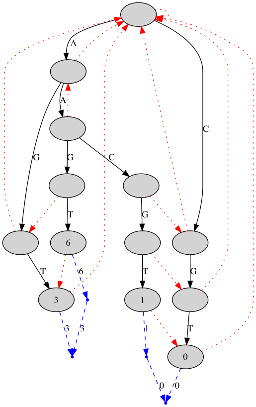

# Test tools

This directory contains various tools you might find useful for examining and testing your read-mappers. You can build all the tools by running

```sh
make
```

in this directory.

## edit_cloud

This tool builds the edit-cloud around a string. It takes three arguments, the edit-distance to explore around the core string, then the core string itself, and finally the alphabet to use for the exploration, provided as a string of characters.

Running

```sh
$ ./edit_cloud 1 AA ACGT                                                            
```

produces this:

```
CGT 1I3M
AACGT 1D4M
AACGT 1D4M
AGT 1M1I2M
AACGT 1M1D3M
AACGT 1M1D3M
AAGT 4M
AAGT 4M
AGT 1M1I2M
AACGT 1M1D3M
AACGT 1M1D3M
AAGT 4M
AAGT 4M
```

The output produces both the edit cloud and the corresponding CIGAR strings.

## display_trie

This tool creates a representation of a trie in the Graphviz `dot` format and you can use it to display a trie over a set of patterns.

As input, it takes patterns in the form `edit_cloud` outputs. It writes the trie to the file `trie.dot` and you can then process this file with Graphviz.

When the same pattern appears more than once in the input—which it will because there are typically multiple ways to get to the same pattern by edits—the trie will not contain the duplications. The trie will be labelled with the number in which a pattern appears in the input, but not all patterns will necessarily be in the trie.

An example of running the program can look like this:

```sh
$ ./edit_cloud 1 AA ACGT > AA.patterns.txt
$ ./display_trie AA.patterns.txt
Building trie.
Computing failure links.
Printing trie graph to "trie.dot"
```

You can then display the result using the `dot` tool from Graphviz:

```sh
bash-3.2$ dot -Tpdf < trie.dot > trie.pdf
```

The result is this trie:



